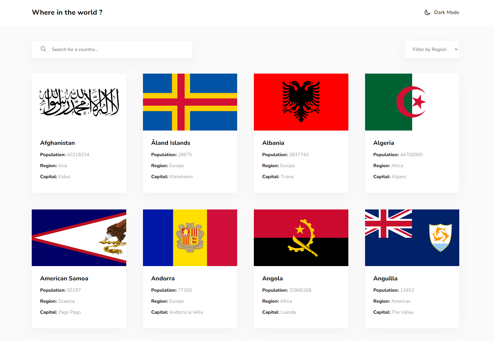
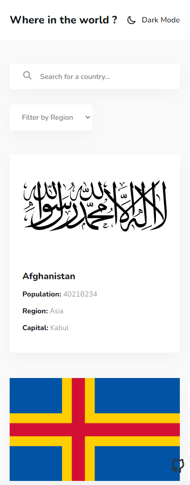

|  |
| :--------------------------------------------: |
|               _Desktop Preview_                |

|  |
| :------------------------------------------: |
|               _Mobile Preview_               |

# REST Countries API using Next.js

### [Live](https://next-countries-yusuf.vercel.app) | [Solution](https://www.frontendmentor.io/solutions/rest-countries-api-with-nextjs-7qqMMjMadq) | [Challenge](https://www.frontendmentor.io/challenges/rest-countries-api-with-color-theme-switcher-5cacc469fec04111f7b848ca)

## About This Project

I completed this project using Next.js which is powerfull to build Static Site Generation (SSG) like this. A big thank you to anyone providing feedback on my [solution](https://www.frontendmentor.io/solutions/rest-countries-api-with-nextjs-7qqMMjMadq)
